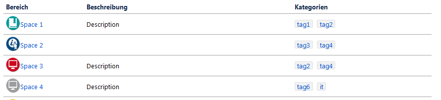
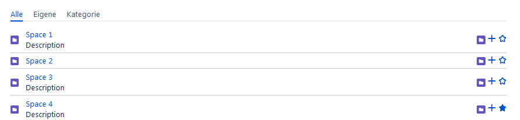
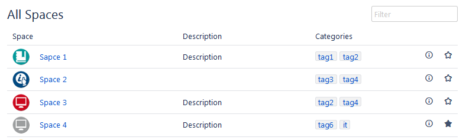

# ConfluenceMacros
A repository for Confluence User Macros

#  [spacelist](/spacelist/)
A macro to list the spaces the same way as the `space directory` view in confluence does at any page.
In Confluence the default `space` macro doesn't show the space icons and it is not possible to show the `space directory` view as a page content.

It's possible to filter the view depending on the categories.

This is how `spacelist` look like: 

But this is how the integrated confluence `spaces` macro look: 

And thats how the `space directory` look: 
